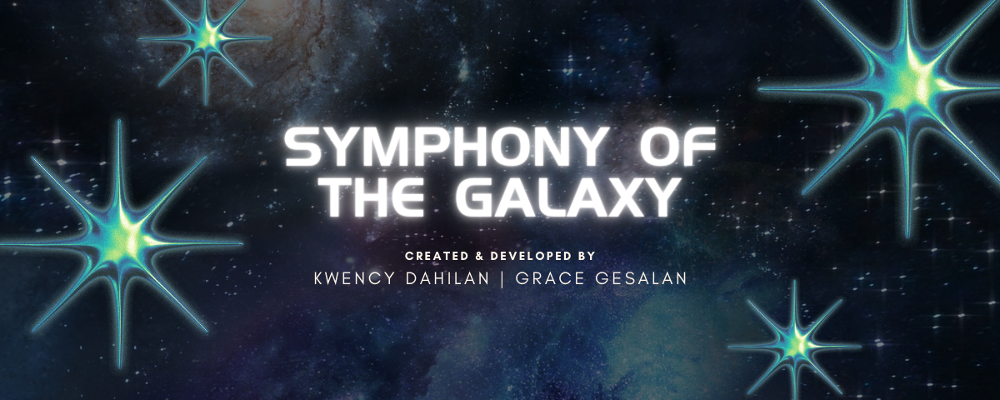

# Symphony of the Galaxy Music Mixer

Symphony of the Galaxy is an immersive and educational game that takes players on a journey through the vast expanse of space. In this game, you get to explore the universe and its planets, and create your own symphony by dragging and dropping the planets into the game.

Each planet in the game has its own unique sound, which players can listen to by clicking and dragging it to the dropzone. Players can also control the sound of each planet by muting, pausing or playing it. This allows players to experiment with different combinations of sounds and create their own unique symphony of the galaxy. Symphony of the Galaxy is a game that is both fun and educational, teaching players about the science and wonder of our universe while allowing them to express their creativity through music.

So get ready to embark on a journey through the stars, and create your very own Symphony of the Galaxy!

## Music Mixer

Created a webpage for a Music Mixer

## Contributing

1. Fork it!
2. Create your feature branch: `git checkout -b my-new-feature`
3. Commit your changes: `git commit -am 'Add some feature'`
4. Push to the branch: `git push origin my-new-feature`
5. Submit a pull request :D

## Credits

Kwency Maye Dahilan 
Apple Grace Gesalan

## License

MIT